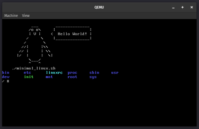
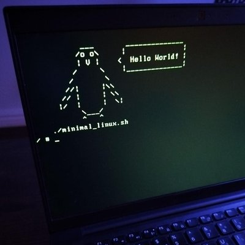

# Minimal linux build

An example of a minimal GNU/linux build.

Can be be used as-is to mock a lightweight / embedded linux,
or extended to switch root to a full user space.

Created while learning a bit more about typical linux startup process.

 

## Prerequisites 

* Debian based linux distro... or run in a debian container :)
* Packages listed in ``minimal_linux.sh``
* Missing package dependencies will be logged.
* No root permissions should be needed after requirements are installed.
* qemu if you want to run the result easily

On debian you can install required packages with:
```
sudo apt update;
sudo apt-get install -y
    bison \
    build-essential \
    flex \
    gcc \
    grub-common \
    grub-pc-bin \
    grub-pc \
    grub-efi \
    libelf-dev \
    libncurses5-dev \
    libssl-dev \
    pv \
    xorriso \
    xz-utils;
``` 


## Usage

Create a minimal linux system:

```
# Build a minimal linux iso:
make
# Generates:
# build/minimal_linux.iso

# To run iso:
qemu-system-x86_64 -drive format=raw,file=build/minimal_linux.iso -m 512

# To run kernel and initrd in current terminal:
qemu-system-x86_64 -kernel ./build/iso/boot/bzImage -initrd ./build/iso/boot/initramfs.cpio.gz -nographic -append "console=ttyS0" -vga std

# To run iso directly in current terminal:
qemu-system-x86_64 -drive format=raw,file=build/minimal_linux.iso -m 512 -nographic -vga std

```

## Boot sequence

Boot sequence of the resulting image could be interpreted as:

```
[ qemu / BIOS ] -> [ grub2 ] -> [ kernel ] -> [ initramfs ] -> [ /init ]

( ---> then optional switch root to full userspace )
```

## Switch root to full user space

There are two methods provided to switch root into full user space:

* Method 1: Virtual filemount
* Method 2: Full ISO creation

Both methods rely on the existence of a valid filesystem,
like would be used for a chroot jail.
This is likely to look something like:

```
build/
└── custom
    └── rootfs
        ├── bin
        ├── etc
        ├── home
        ├── lib
        ├── lib64
        ├── opt
        ├── root
        ├── sbin
        ├── usr
        └── var
# Note kernel/virtual filesystems are not mounted (proc/run/dev)

switch_root is handled but the '/init' script which you may want to modify as needed.
For example you may want to use a sqashfs instead of an uncompressed rootfs folder.
This requires modifying the kernel/initramfs to support this.

```

### Switch root method 1: Virtual filemount user space to QEMU

```
# You have already created:
# build/custom/rootfs/{bin,etc,home,lib,lib64,opt,root,sbin,usr,var}

# Create the minimal_linux.iso / bzImage / initramfs
./minimal_linux.sh

# Run qemu and passthrough rootfs as a virtual filesystem.
qemu-system-x86_64 -enable-kvm -cpu host -vga std \
  -kernel ./build/iso/boot/bzImage \
  -initrd ./build/iso/boot/initramfs.cpio.gz \
  -nographic -append "console=ttyS0 quiet loglevel=0 nosplash" \
  -fsdev local,security_model=passthrough,id=fsdev0,path=rootfs \
  -device virtio-9p-pci,id=fs0,fsdev=fsdev0,mount_tag=rootfs
#
# NOTE: You may need to look into selinux/apparmor and uid/gid for this to function as writable.
#
```

### Switch root method 2: Full ISO creation

```
# You have already created:
# build/custom/rootfs/{bin,etc,home,lib,lib64,opt,root,sbin,usr,var}

# Create the minimal_linux.iso / bzImage / initramfs
./minimal_linux.sh

# Create the full custom iso:
./minimal_linux_custom.sh
```
